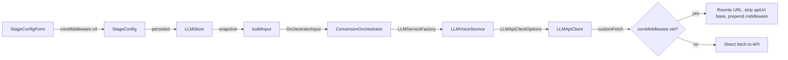

## Add CORS Middleware support for any OpenAI-compatible provider

**Root cause**: Any OpenAI-compatible API provider may lack CORS headers (confirmed for NVIDIA via curl OPTIONS test). Since this app is browser-only, a local CORS proxy is the universal fix. The `local-cors-proxy` npm package provides this out of the box.

### User experience (Win 11 PowerShell, two copy-paste commands)

**Step 1** - Install Node.js (one-time, skip if already installed):
```powershell
winget install OpenJS.NodeJS.LTS
```
Then **restart PowerShell** for PATH to take effect.

**Step 2** - Run CORS middleware:
```powershell
npx local-cors-proxy --proxyUrl https://integrate.api.nvidia.com --port 8010
```
Then in the app's LLM settings, set **CORS Proxy** to `http://localhost:8010/proxy`.

### Implementation

**1. Add `corsMiddleware` to `StageConfig`** (`src/stores/LLMStore.ts`)
- Add optional `corsMiddleware: string` field (defaults to `''`)
- Persist/load like other stage fields

**2. Thread `corsMiddleware` through the pipeline**
- Add `corsMiddleware?: string` to `StageLLMConfig` in `ConversionOrchestrator.ts`
- Add `corsMiddleware?: string` to `LLMApiClientOptions` in `LLMApiClient.ts`
- Add `corsMiddleware?: string` to `LLMVoiceServiceOptions` in `LLMVoiceService.ts`
- Pass it through `buildInput()` in `useTTSConversion.ts`
- Pass it through `LLMTab.tsx` test connection flow and copy settings

**3. Rewrite URL in `LLMApiClient.ts` `customFetch`**
- When `corsMiddleware` is non-empty, rewrite the fetch URL: strip the original API base URL from the request path and prepend the middleware URL. E.g. request to `https://integrate.api.nvidia.com/v1/chat/completions` becomes `http://localhost:8010/proxy/chat/completions`
- The middleware URL the user enters is just the base (e.g. `http://localhost:8010/proxy`), and the path beyond the API base is appended automatically
- Works for any OpenAI-compatible provider, no provider detection needed

**4. Add CORS Middleware UI to `StageConfigForm.tsx`**
- Input field for the middleware base URL (in Advanced Settings section)
- Collapsible help section with the copy-paste PowerShell commands (winget + npx)
- When empty, no middleware is used (default, zero change for existing users)

**5. Improve CORS error message in `LLMApiClient.ts`**
- Change: `"CORS Error - API does not allow browser requests. Start a local CORS proxy and set the proxy URL in Advanced Settings."`
- No provider-specific logic needed

**6. Update `public/llm-help.md`**
- Change "needs CORS proxy" to generic guidance with setup commands
- Add note about `local-cors-proxy` as universal fix

### Data flow



### Files changed (8)
1. `src/stores/LLMStore.ts` - add `corsMiddleware` to `StageConfig`, persist/load
2. `src/services/llm/LLMApiClient.ts` - add `corsMiddleware` to options, URL rewrite in `customFetch`, improve CORS error
3. `src/services/llm/LLMVoiceService.ts` - thread `corsMiddleware` to `LLMApiClient` constructors
4. `src/services/ConversionOrchestrator.ts` - add `corsMiddleware` to `StageLLMConfig`
5. `src/hooks/useTTSConversion.ts` - pass `corsMiddleware` in `buildInput`
6. `src/components/settings/tabs/StageConfigForm.tsx` - CORS middleware UI with help
7. `src/components/settings/tabs/LLMTab.tsx` - pass `corsMiddleware` in test connection, copy settings
8. `public/llm-help.md` - add universal CORS proxy setup guidance
