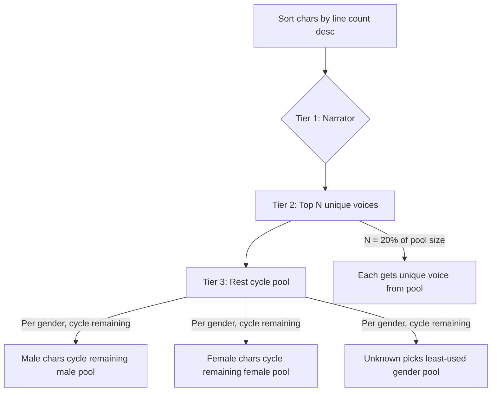

# Improve Voice Allocation: Tiered Frequency-Based Assignment

## Problem

Current `allocateByFrequency` gives **almost every character** a unique voice until the pool runs out, then dumps the rest into 3 "rare" voices (one per gender). For a book with 1177 characters and a 38-voice pool, this means:
- ~34 chars get unique voices (many with just 1 line)
- ~1143 chars all collapse into the same 3 voices
- No intentional "tiering" — minor characters who speak once soak up unique voices that should go to meaningful characters

## Proposed: Tiered Voice Allocation

Replace `allocateByFrequency` and `randomizeBelow` with a shared 3-tier strategy:



### Tier Breakdown (given pool of M male + F female voices):

| Tier | Who | Voices |
|------|-----|--------|
| **Narrator** | 1 reserved voice | Narrator voice, excluded from pool |
| **Top speakers** | Top `ceil(0.2 * (M+F))` chars by frequency | Each gets a unique voice from their gender pool |
| **Rest** | All remaining chars | Cycle through **remaining** (unreserved) pool voices per gender |

### Key Rules:
1. **Pool budget**: `uniqueSlots = ceil(0.2 * totalPoolSize)`. These unique slots are distributed proportionally by gender demand (more male speakers = more male unique slots).
2. **Top speakers get unique** — the most-heard characters are the most important to distinguish.
3. **Rest cycle remaining pool** — low-speaker characters each get a voice from the leftover pool (after narrator + top speakers reserved), cycling when exhausted. This is KISS and avoids the "1143 chars share 1 voice" problem.
4. **Gender-aware cycling**: male chars cycle male leftovers, female cycle female leftovers, unknown picks the least-used gender pool.

## Files to Change

### 1. `src/services/VoiceAllocator.ts` — Core logic

**Rename + refactor `allocateByFrequency`** into `allocateTieredVoices`:

```typescript
export interface TieredAllocationOptions {
  characters: LLMCharacter[];
  frequency: Map<string, number>;       // char name -> line count
  pool: VoicePool;
  narratorVoice: string;
  reservedVoices?: Set<string>;
  topPercent?: number;                   // default 0.2 (20%)
}

export function allocateTieredVoices(opts: TieredAllocationOptions): VoiceAllocation
```

Logic:
1. Sort characters by frequency descending
2. `uniqueSlots = ceil(topPercent * (pool.male.length + pool.female.length))`
3. Reserve narrator voice
4. **Top N chars**: each gets `tracker.pickVoice(gender)` (unique, sequential from priority pool)
5. **Remaining chars**: cycle through remaining (unreserved) pool voices per gender — `tracker.pickVoice(gender)` naturally handles this since it cycles when pool exhausted
6. Add `MALE_UNNAMED` / `FEMALE_UNNAMED` / `UNKNOWN_UNNAMED` using rare voices (first unused voice per gender after all assignments)
7. Map variations to canonical voice

### 2. `src/services/VoiceAllocator.ts` — Refactor `randomizeBelow`

Rewrite `randomizeBelow` to use the **same tiered logic** but scoped below `clickedIndex`:

1. Voices for chars 0..clickedIndex are **frozen** (reserved)
2. Chars from clickedIndex+1 onward get the tiered treatment:
   - Top `ceil(0.2 * remainingPoolSize)` by frequency get unique from remaining pool
   - Rest cycle through leftovers

This ensures clicking 🎲↓ on row 6 runs identical allocation logic for rows 7+.

### 3. `src/services/ConversionOrchestrator.ts` — Call site

Replace `allocateByFrequency(characters, assignments, ...)` with the new `allocateTieredVoices(...)`. Pass frequency map directly instead of re-counting.

### 4. Tests — `src/services/VoiceAllocator.test.ts`

- Test tiered allocation: verify top 20% get unique, rest cycle
- Test gender proportionality
- Test randomizeBelow respects frozen rows and applies same tiering
- Test edge cases: pool smaller than 5, all same gender, single character

### 5. `src/services/llm/VoiceProfile.ts` — `assignVoicesTiered`

Update to use the new shared logic (or keep its simpler path if it operates on `CharacterEntry[]` with no gender pool — needs a small adapter).

## What Stays the Same
- `allocateByGender` (initial pre-assignment) — untouched
- `VoicePoolBuilder` / `buildPriorityPool` / `deduplicateVariants` — untouched
- `VoiceReviewModal` UI — untouched (same 🎲↓ button, calls same `randomizeBelowVoices`)
- Narrator is always reserved
- Voice dedup (Multilingual pairs) — untouched

## Summary of Improvements
- **Before**: ~34 chars get unique (many minor), ~1143 chars share 3 voices
- **After**: Top ~8 chars (20% of 38 pool) get unique, remaining ~1169 chars cycle through ~28 leftover voices per gender — much better voice diversity for the "rest"
